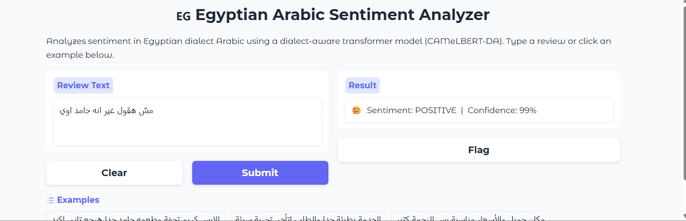
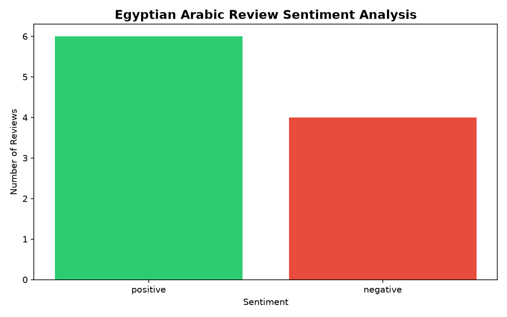

# Egyptian Arabic Sentiment Analysis
🔗 **Live Demo:** https://huggingface.co/spaces/andrewaymananis3/egyptian-arabic-sentiment

A natural language processing project that analyzes sentiment in **Egyptian dialect Arabic** restaurant reviews using pretrained transformer models, with an interactive web app.

## Overview

This project classifies Arabic text as **positive** or **negative**, focused on Egyptian colloquial dialect — a harder problem than Modern Standard Arabic, since most Arabic NLP models are trained primarily on formal Arabic.

## Demo

The interactive Gradio app analyzing a real Egyptian Arabic review:

Sentiment breakdown across a batch of reviews:

## What it does

- Classifies sentiment in **English** (DistilBERT) and **Egyptian Arabic** (CAMeLBERT-DA, a dialect-aware Arabic model)
- Runs batch analysis on multiple reviews and **visualizes** the sentiment breakdown
- Evaluates model performance on a **custom dataset of real Egyptian reviews** I collected and annotated myself
- Provides an **interactive web app** (Gradio) where users can type a review and get a live prediction

## The dataset

Since no labeled Egyptian-dialect restaurant-review sentiment dataset was readily available, I **collected and annotated my own**: 17 real reviews of B Laban (a popular Egyptian dessert chain) from Google Maps, hand-labeled as positive or negative. This reflects real-world ML practice, where data collection and annotation are often the first and most important steps.

## Results

On the custom Egyptian review set, the CAMeLBERT-DA model achieved **100% accuracy** (precision, recall, and F1 all 1.00 across both classes).

**Interpretation:** While encouraging, I treat this result with caution. The test set is small (17 reviews) and carried mostly clear, unambiguous sentiment. A more rigorous evaluation would use a larger sample with more borderline cases — for example, mixed reviews like "good but pricey," where the model's confidence drops to around 0.5, reflecting genuine ambiguity. This is a known limitation of single-label sentiment models.

## Tech stack

- **Python**
- **Hugging Face Transformers** (DistilBERT, CAMeLBERT-DA)
- **PyTorch** (model backend)
- **scikit-learn** (evaluation: accuracy, precision, recall, F1, confusion matrix)
- **matplotlib** (visualization)
- **Gradio** (interactive web app)

## How to run

Install the dependencies and launch the app:

    pip install transformers torch scikit-learn matplotlib gradio
    python app.py

Then open the local URL shown in the terminal to use the web app.

## Files

- `app.py` — interactive Gradio web app
- `sentiment.py` — English sentiment analysis
- `arabic_sentiment.py` — Egyptian Arabic sentiment analysis
- `sentiment_dashboard.py` — batch analysis with visualization
- `balaban_reviews.py` — custom annotated Egyptian review dataset
- `evaluate_balaban.py` — model evaluation against ground-truth labels

## Future work

- Expand the dataset with more reviews, including ambiguous/mixed sentiment
- Add a neutral class (currently binary positive/negative)
- Explore aspect-based sentiment (separating food vs. service vs. price)
- Fine-tune a model on Egyptian-specific data

## Author

**Andrew Fahmy** — Software Engineering graduate specializing in Data Science and AI
